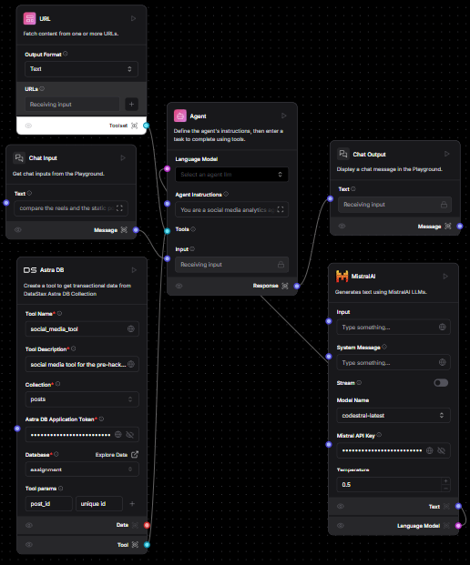

# **Social Media Analytical Tool** 🚀  

Unleash the power of AI-driven insights with our Social Media Analytical Tool! This innovative platform combines cutting-edge AI integration via **Langflow** and robust data handling through **DataStax Astra DB**, delivering a seamless experience for analyzing social media trends.  

**Tech Stack:**  
- 🧠 **Langflow** for intelligent data analysis.  
- 🌐 **Next.js** + **TypeScript** for a powerful backend and frontend experience.  
- 🛠️ **React Hook Form** for a smooth and interactive user experience.  

---

## **Key Features**  

1. **📊 Effortless Data Loading**:  
   Pre-loaded data is ready to go! Quickly access and analyze without any setup hassle.  

2. **🔍 Smart Query Selection**:  
   Choose from pre-defined queries that best fit your analytical needs.  

3. **✍️ Custom Queries, Made Simple**:  
   Have a unique question in mind? Add it easily with our intuitive text area feature.  

---

### **How It Works**  

Submit your queries, and let the AI do the heavy lifting! The tool generates dynamic visualizations like **charts** that break down social media metrics, including:  
- Average likes, shares, and comments.  
- Post-type performance analysis.  

Get actionable insights in seconds!  

---

### **Langflow Magic**  

Here’s a sneak peek at the flow diagram guiding the AI engine:  

  

This visual represents how Langflow processes user inputs to produce stunning, data-rich responses that empower better decision-making.  
